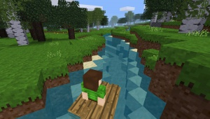

minetest mod boats
==========================

Boats improved for better performance and more realistic..

Information
-----------

This mod is named `boats`, it features work from original mod, 
code changed to make it turn **quicker, better performance agains lag**, 
and if you hit the shore too hard the boat is destroyed and drops 3 wood



#### Additions by TenPlus1

changed by TenPlus1 to add some new features
- boat is destroyed when crashing at speed (drops 3 wood)
- boats drop after 10 seconds if no driver
- boats can be damaged by mobs attacking player
- Improve physics of boat by implementing drag force (thanks gnag65)
- nil player check functions by misterskullz

Technical informaton
--------------------

When crafted you can use by putting and right click on, 
then control with your directional keys:

#### Dependencies

* default
* mesecons (optional)

#### Crafting

W = any thing from wood group

```
   
W W
WWW
```
#### nodes

| Name         | node            | notes |
| ------------ | --------------- | ----- |
| Boat         | boats:boat      | it destroyed when crash at speed |

#### Controls (by default if not changed)

| Default key assigned | Action                                 |
| -------------------- | -------------------------------------- |
| Right mouse button   | Enter or exit boat when pointing at boat. |
| Forward              | Speed up.  Slow down when moving backwards. |
| Forward + backward   | Enable cruise mode: accelerate to maximum speed without needing to hold. |
| Backward             | Slow down. Speed up when moving backwards. Disable cruise mode. |
| Left                 | Turn to the left. Turn to the right when moving backwards. |
| Right                | Turn to the right. Turn to the left when moving backwards. |

Licence
------

**Source code**

Modifications by TenPlus1
Originally by PilzAdam (MIT)
Various Minetest developers and contributors (MIT)

**Media (textures and model)**

Textures: Zeg9 (CC BY-SA 3.0)
original Model thetoon and Zeg9 (CC BY-SA 3.0),
modified by PavelS(SokolovPavel) (CC BY-SA 3.0),
modified by sofar (CC BY-SA 3.0)

Check [lisence.txt](lisence.txt)
