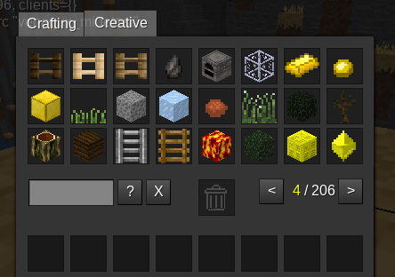

Minetest Game mod: creative
===========================

Simplified creative for more accurate on mobile or small screens

Information
------------

This mod is named `creative` and is a replacement for default "creative" mod 
of orginal game, with reduced tabs, also minenux fork it uses a cached memory and no images 
to faster lodaing respect settings.

Technical Information
----------------------

This mod fork used as base the commit `72acd4db9cc676f9e0ae1435e371adb2b10cdbe8`, 
for backguard compatibility with 5.2 and 0.4.16, with minimal backports, you 
can download from https://codeberg.org/minenux/minetest-mod-creative and after 
clone or downloaded renamed to `creative` (obviously replace the current one if any)

Modified by TenPlus1 (added creative privilege, reduced tab count, tweaked code),
original work is at https://notabug.org/TenPlus1/creative

The minenux fork cut down images to use only text so media download is not a hit!

#### Api

You can use `creative.is_creative(playername)` (older) or `creative.is_enabled_for(playername)`.

#### Dependencies

* sfinv

### Authors of source code

Originally by Perttu Ahola (celeron55) <celeron55@gmail.com> (MIT)
Jean-Patrick G. (kilbith) <jeanpatrick.guerrero@gmail.com> (MIT)

### Author of media (textures)

Jean-Patrick G. (kilbith) <jeanpatrick.guerrero@gmail.com> (CC BY-SA 3.0)

LICENSE
-------

See [license.txt](license.txt) for license information.

