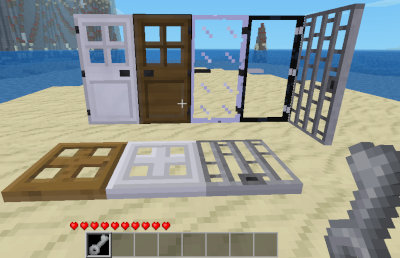

minetest mod Doors Redo
=========================

This mod improves doors, featured also a master key

Information
-----------

This mod must be named `doors` a improvement version of the built-in Doors mod 
also featured the player to craft a key tool which can be used on any of the
registered doors to flip between states (open, owned, protected)

Tech information
----------------

This mod sustitute default one, you must disable the default of minetest 
game if present or override it.

#### Door States

* OPEN - This is like default Doors mod, can be opened by any player or dug up.
* OWNED - This locks the door so that only the owner can open or dig the door.
* PROTECTED - This locks the door but based on protected area the door sits inside.

Note: A protection mod must be installed to use Protected mode so that it works
properly, not having one running will mean all protected doors will open for
anyone who uses them.

#### Dependencies

* default

Optional dependences:

* screwdriver
* creative (only in newer engines)
* protector

#### Nodes

| Node name               | Description name      |
| ----------------------- | --------------------- |
| doors:hidden            | Hidden Door Segment   |
| doors:trapdoor          | Trapdoor              |
| doors:trapdoor_steel    | Steel Trapdoor        |
| doors:door_steel        | Steel Door            |
| doors:door_glass        | Glass Door            |
| doors:door_obsidian_glass | Obsidian Glass Door |
| doors:door_phiwari      | Phiwari's Wooden Door |
| doors:door_iceage       | IceAge's Wooden Door  |
| doors:gate_wood         | Wooden Fence Gate     |
| doors:gate_acacia_wood  | Acacia Fence Gate     |
| doors:gate_junglewood   | Junglewood Fence Gate |
| doors:gate_pine_wood    | Pine Fence Gate       |
| doors:gate_aspen_wood   | Aspen Fence Gate      |

#### Items tools

The key tool is crafted using 5x steel ingots (2x2 box in lower left and 1 in
top right).  When held in players hand you can punch a door to flip between each
state to open, lock (own) and protect the door.

| Node item             | Description name      |
| --------------------- | --------------------- |
| doors:key             | Key Tool              |

#### Know issues

In past were reported some issues with homedecor doors, as 
in https://notabug.org/TenPlus1/doors/issues/3 #3 ..

Replacing the older homdecor doors with their new door api counterparts.

License
-------

#### Authors of source code

Originally by PilzAdam (MIT)

Modified by BlockMen (MIT): Added sounds, glass doors (glass, obsidian glass) and trapdoor.

Modified by sofar (sofar@foo-projects.org) (MIT):
Added Steel trapdoor.
Re-implemented most of the door algorithms, added meshes, UV wrapped texture.
Added doors API to facilitate coding mods accessing and operating doors.
Added Fence Gate model, code, and sounds.

Various Minetest developers and contributors (MIT)

Finally featured by TenPlus1

#### Authors of media (textures)

Following textures created by Fernando Zapata (CC BY-SA 3.0):
  door_wood.png
  door_wood_a.png
  door_wood_a_r.png
  door_wood_b.png
  door_wood_b_r.png

Following textures created by BlockMen (CC BY-SA 3.0):
  door_trapdoor.png
  door_obsidian_glass_side.png

Following textures created by celeron55 (CC BY-SA 3.0):
  door_glass_a.png
  door_glass_b.png

Following textures created by PenguinDad (CC BY-SA 4.0):
  door_glass.png
  door_obsidian_glass.png

Following textures created by sofar (CC-BY-SA-3.0):
  doors_trapdoor_steel.png

Following textures created by paramat (CC-BY-SA-3.0):
  door_trapdoor_side.png
  doors_trapdoor_steel_side.png

Obsidian door textures by red-001 based on textures by Pilzadam and BlockMen (CC BY-SA 3.0):
  door_obsidian_glass.png

Glass door textures by Krock and paramat based on textures by VanessaE (CC BY-SA 3.0):
  doors_door_glass.png
  doors_item_glass.png

TenPlus1 (CC-BY-SA-3.0):
  doors_key.png

All other textures (created by PilzAdam) (CC BY-SA 3.0):

Door textures were converted to the new texture map by sofar, paramat and
red-001, under the same license as the originals.

#### Authors of media (models)

Door 3d models by sofar (CC-BY-SA-3.0)
 - door_a.obj
 - door_b.obj
Fence gate models by sofar (CC-BY-SA-3.0)
 - fencegate_open.obj
 - fencegate_closed.obj

#### Authors of media (sounds)

Opening-Sound created by CGEffex (CC BY 3.0), modified by BlockMen
  door_open.ogg
Closing-Sound created by bennstir (CC BY 3.0)
  door_close.ogg
fencegate_open.ogg:
  http://www.freesound.org/people/mhtaylor67/sounds/126041/ - (CC0 1.0)
fencegate_close.ogg:
  http://www.freesound.org/people/BarkersPinhead/sounds/274807/ - (CC-BY-3.0)
  http://www.freesound.org/people/rivernile7/sounds/249573/ - (CC-BY-3.0)
Steel door sounds open & close (CC-BY-3.0) by HazMatt
  - http://www.freesound.org/people/HazMattt/sounds/187283/
  doors_steel_door_open.ogg
  doors_steel_door_close.ogg
doors_glass_door_open.ogg, doors_glass_door_close.ogg:
  https://www.freesound.org/people/SkeetMasterFunk69/sounds/235546/ (CC0 1.0)

Check [license.txt](license.txt)
