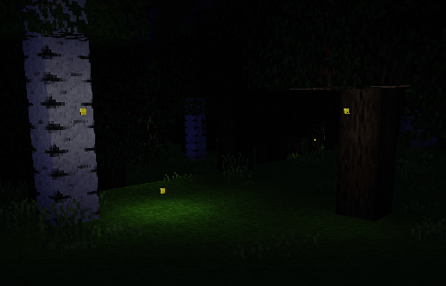

minetest mod Fireflies
======================

Adds fireflies which can be caught in a net and placed in bottles for lighting

Information
-----------

This is a simple Minetest mod by Shara RedCat that adds fireflies to the world on mapgen, which can then be caught in a net and placed in bottles to provide light. Note that they only appear on newly generated map.

This mod was originally adapted from original but with featured ethereal more biomes, that was adapted from the Hidden Worlds subgame to work with Minetest Game, and has since been added to Minetest Game itself. This version (at https://github.com/Ezhh/fireflies) is now maintained independently from the main Minetest Game version for the purpose of possible expansions to the mod which may or may not also be added to Minetest Game at a later time.

Thanks to shivajiva for helping work through the original idea and for assisting with the code, and to all those who helped test this mod so far.



## Techinal info
-------------

Please note that the current stable version of Minetest (0.4.16) is unable to position the fireflies above groundlevel. The mod is otherwise fully functional and can be used; but requires the current dev version of Minetest for optimal firefly placement. 

#### nodes

| node name                | Description         | Aditional info                           |
| ------------------------ | ------------------- | ---------------------------------------- |
| fireflies:firefly        | Firefly             | is not a mob, really a node              |
| fireflies:bug_net        | Bug net             | tool type, to catch fireflies            |
| fireflies:firefly_bottle | Firefly in a Bottle | When you catch a firefly with the bottle |

#### Crafts

`fireflies:firefly_bottle`

```
		{"fireflies:firefly"},
		{"vessels:glass_bottle"}
```

`fireflies:bug_net`

```
		{"farming:string", "farming:string"},
		{"farming:string", "farming:string"},
```

## License
-------

Code for this mod is released under MIT (https://opensource.org/licenses/MIT).

#### Authors of source code

Shara RedCat (MIT)

#### Authors of media (textures)

Shara RedCat (CC BY-SA 3.0):
  fireflies_firefly.png
  fireflies_firefly_animated.png
  fireflies_bugnet.png
  fireflies_bottle.png
  fireflies_bottle_animated.png

fireflies_bugnet.png is modified from a texture by tenplus1 (CC0)

fireflies_bottle.png and fireflies_bottle_animated.png are
modified from a texture by Vanessa Ezekowitz (CC BY-SA 3.0)

check [license.txt](license.txt)
