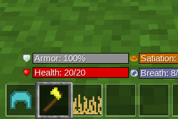

# minetest HUD bars

HUD mod to display as bars and API for

## Information
--------------

This mod changes the HUD of Minetest. It replaces the default health and breath
symbols by horizontal colored bars with text showing the number (or more configured one).

Furthermore, it enables other mods to add their own custom bars to the HUD,
this mod will place them accordingly.

## TEchnical info
-----------------

> **Warning** Keep in mind if running a server with this mod, 
that the custom position should be displayed correctly on every screen size.

#### Dependencies

There's no depends

#### Current version

The current version is 2.3.4.0 its a plus fork from original cos current 
minetest most close mods developers are not so open to support already working servers.

It works for Minetest 0.4.17+ (maybe 0.4.16 too) or later.

#### Settings

This mod can be configured quite a bit. You can change HUD bar appearance, offsets, ordering, and more.
Use the advanced settings menu in Minetest for detailed configuration.

| configuration name           | Description                           | type | values, min/default/max  |
| ---------------------------- | ------------------------------------- | ---- | ------------------------ |
| hudbars_bar_type             | HUD bars style                        | enum | progress_bar progress_bar,statbar_classic,statbar_modern |
| hudbars_autohide_breath      | Automatically hide breath indicators  | bool | true |
| hudbars_alignment_pattern    | HUD bars alignment pattern            | enum | zigzag zigzag,stack_up,stack_down |
| hudbars_sorting              | HUD bars order                        | string | breath=1, health=0 |
| hudbars_pos_left_x           | Left HUD bar screen x position        | float | 0.5 0.0 1.0 |
| hudbars_pos_left_y           | Left HUD bar screen y position        | float | 1.0 0.0 1.0 |
| hudbars_pos_right_x          | Right HUD bar screen x position       | float | 0.5 0.0 1.0 |
| hudbars_pos_right_y          | Right HUD bar screen y position       | float | 1.0 0.0 1.0 |
| hudbars_start_offset_left_x  | Left HUD bar x offset                 | int | -175 |
| hudbars_start_offset_left_y  | Left HUD bar y offset                 | int | -86 |
| hudbars_start_offset_right_x | Right HUD bar x offset                | int | 15 |
| hudbars_start_offset_right_y | Right HUD bar y offset                | int | -86 |
| hudbars_start_statbar_offset_left_x  | Left HUD statbar x offset     | int | -265 |
| hudbars_start_statbar_offset_left_y  | Left HUD statbar y offset     | int | -90 |
| hudbars_start_statbar_offset_right_x | Right HUD statbar x offset    | int | 25 |
| hudbars_start_statbar_offset_right_y | Right HUD statbar y offset    | int | -90 |
| hudbars_vmargin              | Vertical distance between HUD bars    | int | 24 0 |
| hudbars_tick                 | Default HUD bars update interval      | float | 0.1 0.0 4.0 |

#### API

The API is used to add your own custom HUD bars.
Documentation for the API of this mod can be found in [`API.md`.](API.md)

## Legal

#### License of source code

Author: Wuzzy (2015)

Also: This mod was forked from the “Better HUD” [hud] mod by BlockMen.

Translations:

* German: Wuzzy
* Portuguese: BrunoMine
* Turkish: admicos
* Dutch: kingoscargames
* Italian: Hamlet
* Malay: muhdnurhidayat
* Russian: Imk
* Spanish: wuniversales

This program is free software. It comes without any warranty, to
the extent permitted by applicable law. You can redistribute it
and/or modify it under the terms of the MIT License.

#### Licenses of textures

* `hudbars_icon_health.png`—celeron55 (CC BY-SA 3.0), modified by BlockMen
* `hudbars_bgicon_health.png`—celeron55 (CC BY-SA 3.0), modified by BlockMen
* `hudbars_icon_breath.png`—kaeza (MIT License), modified by BlockMen, modified again by Wuzzy
* `hudbars_bgicon_breath.png`—based on previous image, edited by Wuzzy (MIT License)
* `hudbars_bar_health.png`—Wuzzy (MIT License)
* `hudbars_bar_breath.png`—Wuzzy (MIT License)
* `hudbars_bar_background.png`—Wuzzy (MIT License)

#### License references

* [CC-BY-SA 3.0](https://creativecommons.org/licenses/by-sa/3.0/)
* [MIT License](https://opensource.org/licenses/MIT)

