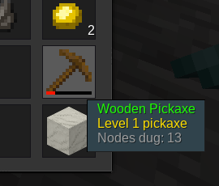

# Minetest tool ranks mod

Tool gains levels for digging nodes. Higher level take longer to wear out.

Information
------------

It adds improved information on the description label of the tools, 
like how much was used the tool and how much is improved, 
and also provides improved xperience over the tool as much you use it..



# Technical information
---------------------

This mod is named `toolranks`

This ranktool is the tenplus1's version, featured custom values throught 
configuration interface for dig speed, mutiplier and durability.

Shows information about the counts the nodes that spend the tool 

Also provide interface to add toolrank support on other mods.

#### Dependencies

* default (now optional)

#### configuration

| Config item                | type  | def  | values      | Description                   |
| -------------------------- | ----- | ---- | ----------- | ----------------------------- |
| toolranks_levels           | int   | 8    | any int     | Level (Number of tool levels) |
| toolranks_level_digs       | int   | 1000 | any int     | Number of nodes that need to be dug to reach the next tool level |
| toolranks_speed_multiplier | float | 1.1  | 1.0 to 10.0 | Dig speed multiplier (at maximum tool level, 1.0 to disable) |
| toolranks_use_multiplier   | float | 1.1  | 1.0 to 10.0 | Durability multiplier (at maximum tool level,1.0 to disable) |

#### mods toolrank support

The default mod of minetest game has default support in this mod, 
but not farming hoes, many other mods already integrates toolrank support, 
by example all the tenplus1's "redo"s mod already has support, others will need 
extra mods like toolranks_extra due rejection from mod authors.

#### how to add support in mods

If so, to support this mod, add this code to your mod, after your tool's code:

```lua
if minetest.get_modpath("toolranks") then
	toolranks.add_tool("mymod:mytool")
end
```

Where `mymod` is the technical/namespace name of the mod and `mytool` the item name.

That function provides all that can be do by custom way also as:

```lua
if minetest.get_modpath("toolranks") then
	minetest.override_item("mymod:mytool", {
			original_description = "My Tool",
			description = toolranks.create_description("My Tool"),
			after_use = toolranks.new_afteruse
		})
	end
end
```

## LICENSE

(c) 2017 lisacvuk
(c) 2017 tenplus1
(c) 2023 mckaygerhard

Code is LGPL v2.1
media is CC-BY

check [license.txt](license.txt)

