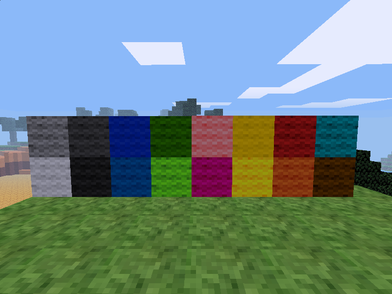

minetest mod wool
=================

Improved Wool mod for Minetest

Information
-----------

It's a simple replacement for the wool mod that allows you to dye any
wool any colour including white, and also added a wool sound when walking
on top of the wool blocks to replace the leaves sound.

Technical info
--------------

This is a improved fork from TenPlus1

#### Dependencies

* default

#### Nodes

| node name       | Description     |
| --------------- | --------------- |
| wool:white      | White Wool      |
| wool:grey       | Grey Wool       |
| wool:black      | Black Wool      |
| wool:red        | Red Wool        |
| wool:yellow     | Yellow Wool     |
| wool:green      | Green Wool      |
| wool:cyan       | Cyan Wool       |
| wool:blue       | Blue Wool       |
| wool:magenta    | Magenta Wool    |
| wool:orange     | Orange Wool     |
| wool:violet     | Violet Wool     |
| wool:brown      | Brown Wool      |
| wool:pink       | Pink Wool       |
| wool:dark_grey  | Dark Grey Wool  |
| wool:dark_green | Dark Green Wool |
| wool:dark_blue  | Dark Blue Wool  |
| wool:gold       | Gold Wool       |

#### Alias

| node name       | node alias      |
| --------------- | --------------- |
| wool:dark_blue  | wool:blue       |
| wool:gold       | wool:yellow     |

License
-------

Textures are from Gambit's PixelBox texture pack.

Sound is from freeSFX.co.uk and has a creative-commons license
