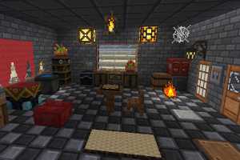

minetest mod XDecor
===================

Decoration lightweight alternative to HomeDecor

Information
-----------

This mod add cute cubes to decoration and minimal set of "moreblock" (some elements of picture may not be available)




Tech information
----------------

This mod is forked more reduced version, more focused on speed over media.

#### Dependencies

* default
* bucket
* doors
* farming
* stairs
* xpanes

Optional:

* fire
* oresplus
* moreblocks
* mesecons

#### LBM

| LBM name                  | node action              | notes and observations |
| ------------------------- | ------------------------ | ---------------------- |
| xdecor:create_book_entity | xdecor:enchantment_table | recreate book entity   |

#### Nodes

| Node name                 | Observacion and notes  |
| ------------------------- | ---------------------- |
| realchess:chessboard      | Chess Board, playable  |
| xdecor:tv                 | Television"),          |
| xdecor:radio              | Radio                  |
| xdecor:speaker            | Speaker                |
| xdecor:cauldron_empty     | Cauldron               |
| xdecor:cauldron_idle      | Cauldron (idle)        |
| xdecor:cauldron_boiling   | Cauldron (active) to put foods inside to make a soup  |
| xdecor:cauldron_soup      | Cauldron (active) to eat the soup  |
| xdecor:hive               | Artificial Hive        |
| xdecor:itemframe          | Item Frame, event huge amoutn only one       |
| xdecor:mailbox            | Mailbox for little exchange       |
| xdecor:pressure_wood_on   | Wooden Pressure Plate  |
| xdecor:pressure_wood_off  | Wooden Pressure Plate (off) |
| xdecor:pressure_stone_on  | Stone Pressure Plate   |
| xdecor:pressure_stone_off | Stone Pressure Plate (off)  |
| xdecor:bamboo_frame       | Bamboo Frame           |
| xdecor:chainlink          | Chainlink              |
| xdecor:rusty_bar          | Rusty Iron Bars        |
| xdecor:baricade           | Baricade"),            |
| xdecor:barrel             | Barrel"),              |
| xdecor:cabinet            | Wooden Cabinet         |
| xdecor:cabinet_half       | Half Wooden Cabinet    |
| xdecor:empty_shelf        | Same as moreblocks:empty_shelf |
| xdecor:multishelf         | Multi Shelf            |
| xdecor:candle             | Candle                 |
| xdecor:chair              | Chair                  |
| xdecor:cobweb             | Cobweb                 |
| xdecor:cushion            | Cushion                |
| xdecor:cushion_block      | Cushion Block          |
| xdecor:enderchest         | Ender Chest            |
| xdecor:ivy                | Ivy                    |
| xdecor:rooster            | Rooster                |
| xdecor:lantern            | Lantern                |
| xdecor:painting_1         | Painting               |
| xdecor:stonepath          | Garden Stone Path      |
| xdecor:cactusbrick        | Cactus Brick           |
| xdecor:coalstone_tile     | Coal Stone Tile        |
| xdecor:desertstone_tile   | Desert Stone Tile      |
| xdecor:hard_clay          | Hardened Clay          |
| xdecor:moonbrick          | Moon Brick             |
| xdecor:stone_tile         | Stone Tile             |
| xdecor:stone_rune         | Runestone              |
| xdecor:packed_ice         | Packed Ice             |
| xdecor:wood_tile          | Wooden Tile            |
| xdecor:table              | Table                  |
| xdecor:tatami             | Tatami                 |
| xdecor:trampoline         | Trampoline             |
| xdecor:woodframed_glass   | Wood Framed Glass      |
| xdecor:rope               | Rope                   |
| xdecor:hammer             | Hammer, use it on workbench |
| xdecor:workbench          | Work Bench, to reapir tools |

#### Crafts

realchess:chessboard 1

```
	{"dye:black",        "dye:white",        "dye:black"       },
	{"stairs:slab_wood", "stairs:slab_wood", "stairs:slab_wood"}
```

xdecor:bowl 3

```
	{"group:wood", "",           "group:wood"},
	{"",           "group:wood", ""          }
```

xdecor:cauldron_empty 1

```
	{"default:iron_lump", "",                  "default:iron_lump"},
	{"default:iron_lump", "",                  "default:iron_lump"},
	{"default:iron_lump", "default:iron_lump", "default:iron_lump"}
```

xdecor:enchantment_table 1

```
	{"",                "default:book", ""                     },
	{"default:diamond", "default:obsidian", "default:diamond"  },
	{"default:obsidian", "default:obsidian", "default:obsidian"}
```

xdecor:hive 1

```
	{"group:stick",   "group:stick",   "group:stick"  },
	{"default:paper", "default:paper", "default:paper"},
	{"group:stick",   "group:stick",   "group:stick"  }
```

xdecor:itemframe 1

```
	{"group:stick", "group:stick",   "group:stick"},
	{"group:stick", "default:paper", "group:stick"},
	{"group:stick", "group:stick",   "group:stick"}
```

xdecor:mailbox 1

```
	{"default:steel_ingot", "default:steel_ingot", "default:steel_ingot"},
	{"dye:red", "default:paper", "dye:red"},
	{"default:steel_ingot", "default:steel_ingot", "default:steel_ingot"}
```

xdecor:pressure_stone_off

```
	{"group:stone", "group:stone"}
```

xdecor:pressure_wood_off",

```
	{"group:wood", "group:wood"}
```

xdecor:lever_off

```
	{"group:stick"},
	{"group:stone"}
```

xdecor:bamboo_frame

```
	{"default:papyrus", "default:papyrus", "default:papyrus"},
	{"default:papyrus", "farming:cotton",  "default:papyrus"},
	{"default:papyrus", "default:papyrus", "default:papyrus"}
```

xdecor:chainlink

```
	{"default:steel_ingot", "", "default:steel_ingot"},
	{"", "default:steel_ingot", ""},
	{"default:steel_ingot", "", "default:steel_ingot"}
```

xdecor:rusty_bar

```
	{"", "default:dirt", ""},
	{"default:steel_ingot", "default:steel_ingot", "default:steel_ingot"},
	{"default:steel_ingot", "default:steel_ingot", "default:steel_ingot"}
```

xdecor:rope 1

```
	{"farming:string"},
	{"farming:string"},
	{"farming:string"}
```


xdecor:hammer 1

```
	{"default:steel_ingot", "group:stick", "default:steel_ingot"},
	{"", "group:stick", ""}
```


xdecor:workbench 1

```
	{"group:wood", "group:wood"},
	{"group:wood", "group:wood"}
```

TODO:


xdecor:curtain_<xxx>

```
	    {"", "wool:xxxx", ""},
	    {"", "wool:xxxx", ""}
```

xdecor:potted_<xxx>

```
	    {"default:clay_brick", "flowers:<xxx>", "default:clay_brick"},
	    {"", "default:clay_brick", ""}
```

### Credits ###

Gambit makes the textures from the PixelBOX pack for Minetest.

This is a fork from original using ideas from [cutting](https://forum.minetest.net/viewtopic.php?f=11&t=14085), [enchanting](https://forum.minetest.net/viewtopic.php?f=11&t=14087), etc

[](https://content.minetest.net/packages/jp/xdecor/)


